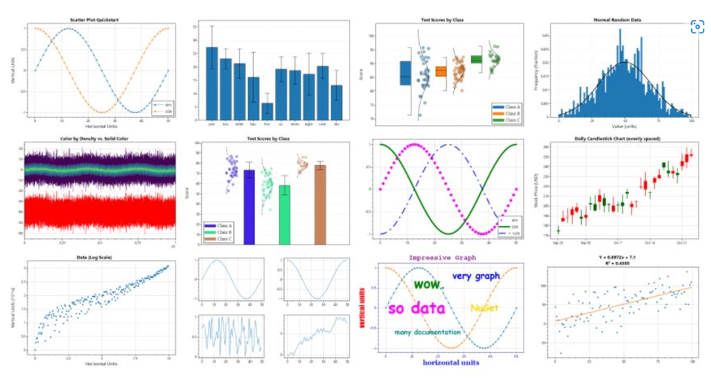
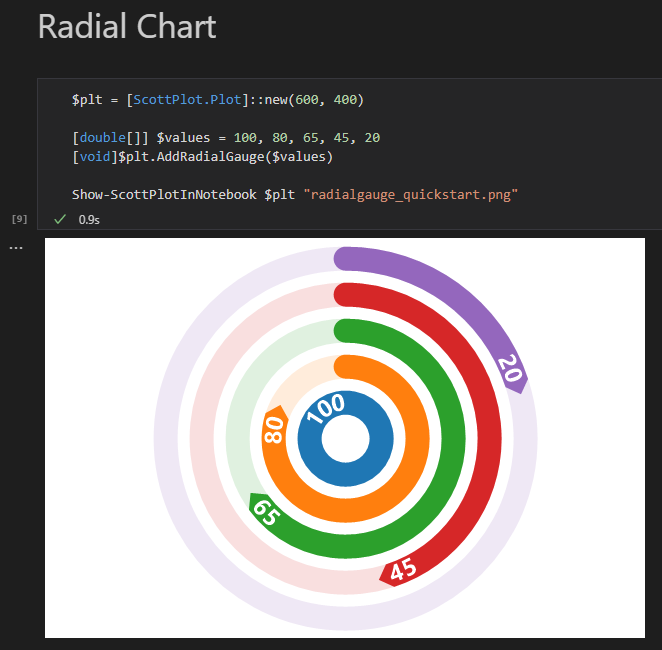

# PowerShell ScottPlot

## ScottPlot

Is a free and [open-source plotting library](https://scottplot.net/) for .NET that makes it easy to interactively display large datasets.

## This repository

Uses Polyglot Interactive Notebooks to demonstrate the capabilities of ScottPlot.

## How to run

- Follow these instructions to setup VS Code and the [Polyglot Interactive Notebooks extension](https://devblogs.microsoft.com/dotnet/polyglot-notebooks-december-2022-release/)
- Clone the repo locally
- Finally, Open the `ScottPlot.ipynb` file in VS Code

## Summary
There are two helper PowerShell scripts.

- ScottPlotHelper.ps1
    - Loads the `ScottPlot.dll` and `psgraphNB.ps1`
    - Has the `Show-ScottPlotInNotebook` function
        - `Show-ScottPlotInNotebook $plt "$pwd\test.png"`
        - Takes a ScottPlot plot, and name of the image file to generate
        - Generates the image file
        - Calls the `Show-ImageInNotebook` function from `psgraphNB.ps1`
        - Then removes the image file

- PSGraphNB.ps1
    - Has the `Show-ImageInNotebook` function
        - `Show-ImageInNotebook "$pwd\test.png"`
        - Takes the name of the image file to display
        - Displays the image in the output cell of the notebook

## What's in the notebook

